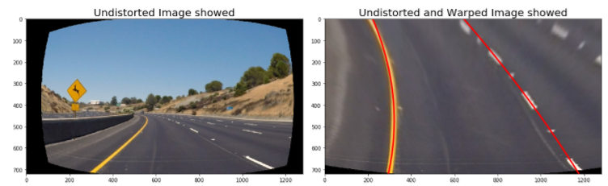
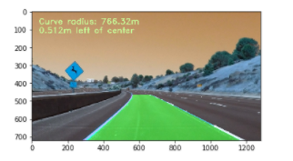

# Advanced Lane Finding

## Udacity Self Driving Car Engineer Nanodegree - Project 4

The goal of this project is to develop a pipeline to process a video stream from a forward-facing camera mounted on the front of a car, and output an annotated video which identifies:
- Compute the camera calibration matrix and distortion coefficients given a set of chessboard images.
- Apply a distortion correction to raw images.
- Use color transforms, gradients, etc., to create a thresholded binary image.
- Apply a perspective transform to rectify binary image ("birds-eye view").
- Detect lane pixels and fit to find the lane boundary.
- Determine the curvature of the lane and vehicle position with respect to center.
- Warp the detected lane boundaries back onto the original image.
- Output visual display of the lane boundaries and numerical estimation of lane curvature and vehicle position.

### Step 1: Distortion Correction
The first step in the project is to remove any distortion from the images by calculating the camera calibration matrix and distortion coefficients using a series of images of a chessboard.

Next, the locations of the chessboard corners were used as input to the OpenCV function `calibrateCamera` to compute the camera calibration matrix and distortion coefficients. 

Finally, the camera calibration matrix and distortion coefficients were used with the OpenCV function `undistort` to remove distortion from highway driving images.

### Step 2: Perspective Transform
The goal of this step is to transform the undistorted image to a "birds eye view" of the road which focuses only on the lane lines and displays them in such a way that they appear to be relatively parallel to eachother (as opposed to the converging lines you would normally see). 

### Step 3: Apply Binary Thresholds
I am using the following color channels and thresholds identifying the lane lines in the provided test images:
- The S Channel from the HLS color space, with a min threshold of 180 and a max threshold of 255, did a fairly good job of identifying both the white and yellow lane lines, but did not pick up 100% of the pixels in either one, and had a tendency to get distracted by shadows on the road.
- The L Channel from the HLS color space, with a min threshold of 210 and a max threshold of 255, did an almost perfect job of picking up the white lane lines, but completely ignored the yellow lines.

Finnaly create a combined binary threshold based on the three above mentioned binary thresholds, to create one combination thresholded image.

### Steps 4 Sliding Window Ployfit
Define method to fit polynomial to binary image with lines extracted, using sliding window 

### Step 5 Fitting a polynomial to the lane lines

### Step 6 Draw save driving space and radius
The final step in processing the images was to plot the polynomials on to the warped image, fill the space between the polynomials to highlight the lane that the car is in, use another perspective trasformation to unwarp the image from birds eye back to its original perspective, and print the distance from center and radius of curvature on to the final annotated image.

## Video Processing Pipeline:
After establishing a pipeline to process still images, the final step was to expand the pipeline to process videos frame-by-frame, to simulate what it would be like to process an image stream in real time on an actual vehicle. 

|Project Video|Challenge Video|
|-------------|-------------|
|||

## Points of failure & Areas of Improvement
The pipeline seems to fail for the harder challenge video. This video has sharper turns and at very short intervals.I think what I could improve is:

1. Take a better perspective transform: choose a smaller section to take the transform since this video has sharper turns and the lenght of a lane is shorter than the previous videos.
2. Average over a smaller number of frames. Right now I am averaging over 12 frames. This fails for the harder challenge video since the shape and direction of lanes changes quite fast.
